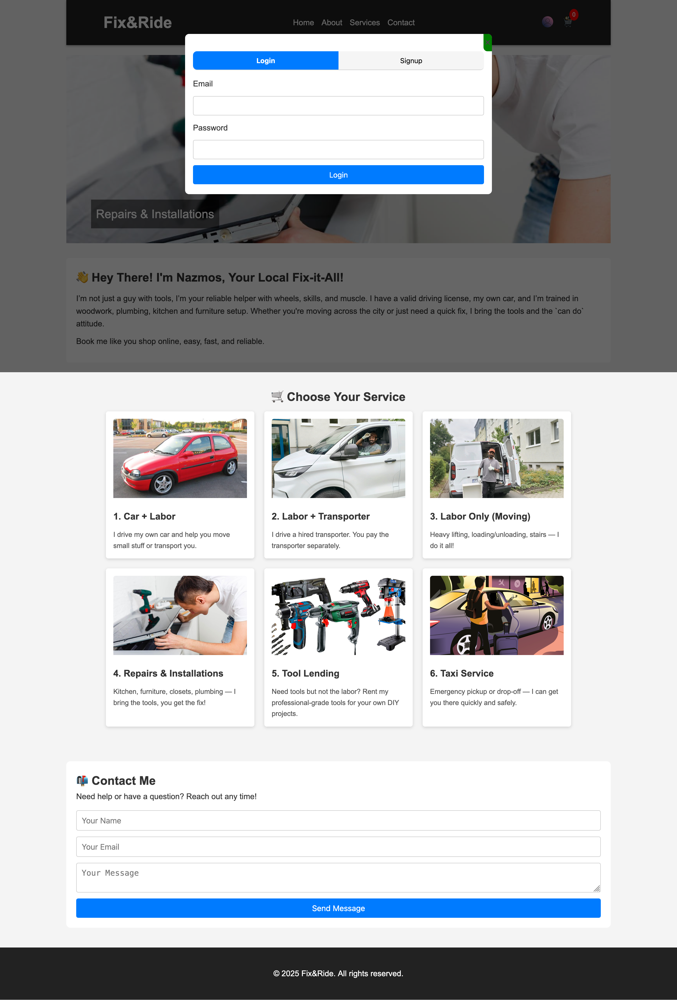

# Fix & Ride

**Easy online booking for labor, transport, repairs, tool rental & taxi services**

Fix & Ride is a web application designed to provide an easy, accessible, and secure way for users to book personal labor and transport-related services online.

## Services Overview

Users can browse and select from the following services:

- **Car + Labor** – Transport of small items with personal assistance
- **Labor + Transporter** – Assistance combined with a hired larger vehicle (transporter)
- **Labor Only (Moving)** – Help with heavy lifting, loading, and unloading
- **Repairs & Installations** – Support with household tasks such as furniture setup, woodwork, and plumbing
- **Tool Lending** – Renting tools for personal DIY projects
- **Taxi Service** – Quick and reliable pickup or transport

The user interface focuses on **clarity**, **accessibility**, and **ease of navigation**. The homepage displays all services in a clear layout with brief descriptions and images, allowing users to quickly find and select the service that best fits their needs.

A built-in account system lets new users sign up and returning users log in, creating a personalized experience where booking information is linked to individual profiles.

When a user selects a service, they are taken to a dedicated **Booking page** showing service details and an interactive calendar + time-slot selector to choose a date and time. After selecting a suitable timeframe, the user can submit the booking request.

## Key Features

- Service browsing with images and short descriptions
- User authentication (sign-up / login)
- Personalized profiles
- Visual availability calendar with time slots
- Clean, responsive, mobile-friendly design
- Secure RESTful backend with token-based authentication

## Architecture

The application is separated into two main parts:

- **Frontend** – User interface and client-side logic (HTML, CSS, Vanilla JavaScript)
- **Backend** – Data processing, business logic, authentication and API (Java + Spring Boot)

This clean separation improves maintainability and allows for easier future extensions.

## Technologies Used

### Frontend
- **HTML5** – Page structure and content
- **CSS3** – Styling and responsive layout
- **Vanilla JavaScript** – Dynamic behavior and user interactions (no frameworks)

### Backend
- **Java 21**
- **Spring Boot 3.5.4** – Core framework, dependency injection, routing
- **Spring Web** – RESTful API endpoints
- **Spring Data JPA** – Database access and persistence
- **Spring Security** – Authentication & basic access control
- **JSON Web Tokens (JJWT)** – Secure token-based API authentication
- **H2 Database (In-Memory)** – Lightweight database for development & testing

### Build & Dependency Management
- **Maven** – Dependency management, build lifecycle, packaging

## Screenshots

### Homepage & Service Selection
The main page greets the user and shows available services with illustrative images (tools, car, moving, repairs, etc.).

<!-- You can replace these with your actual screenshot files once uploaded -->

### Booking Interface
Interactive calendar and time slot selection for booking a service.

## Project Structure (suggested)
